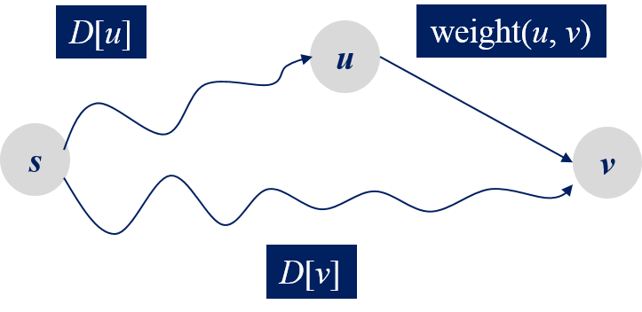
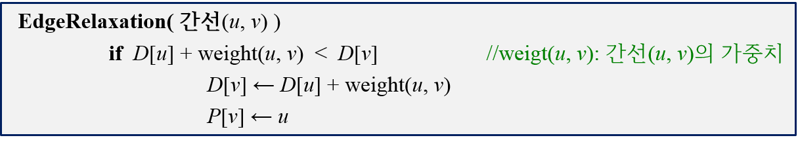
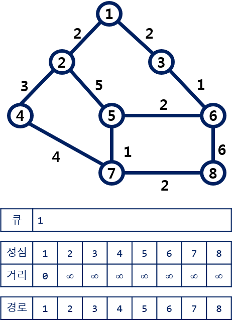
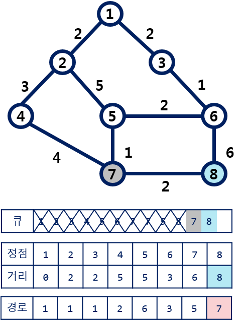

### 최단 경로

#### 간선 완화(Edge Relaxation)

- 아래 그림은 간선 완화의 개념을 보여준다. 반드시 기억해두자.
- 다익스트라 알고리즘에서도 동일한 개념이 적용된다.

- 다음은 간선 완화 알고리즘이다.

#### BFS 로 최단 경로 구하기

- 다음 예제 그래프는 가중치가 부여된 무향 그래프이다. 

- BFS 에 간선 완화 개념을 추가해서 최단 경로를 구할 수 있다.

