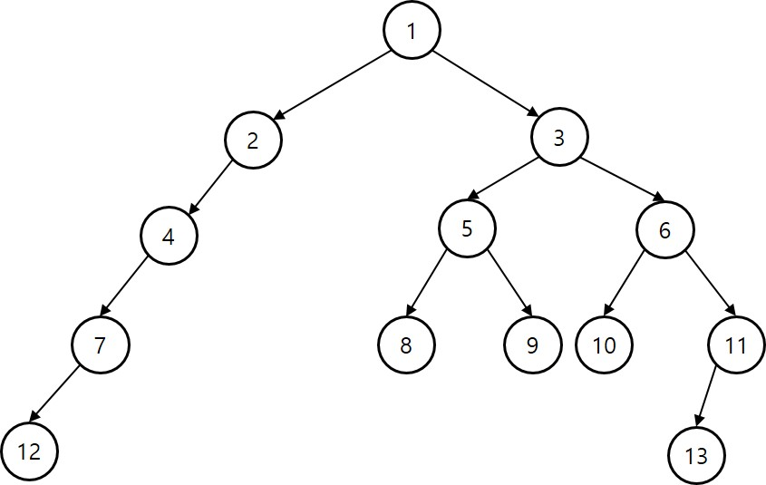

#### 트리 실습

```
    1. 트리의 높이를 계산해서 출력하시오.  treeHeight(3) --> 3
    2. 높이가 3인 노드들을 출력하시오. (7, 8, 9, 10, 11)
    3. 3번 노드가 루트인 트리의 전체 노드수 treeSize(3) --> 8
    4. 8번 노드와 10번 노드의 공통조상을 출력하시오. (1, 3)
``` 

